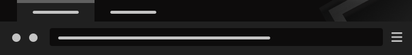
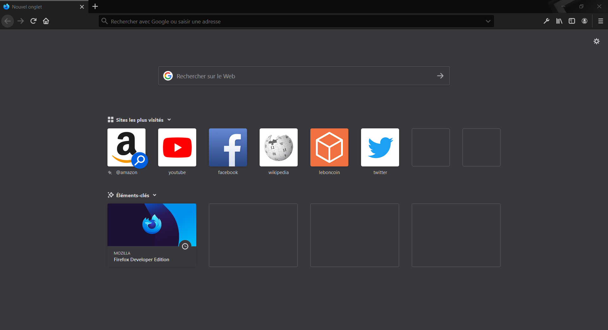

# Thèmes Mozilla Firefox - by Nesios

##  Thème Darken-Nesios v0.1.6

Thème sombre pour votre navigateur Mozilla Firefox.

> [Téléchargement  sur le site Addons.Mozilla.org.](https://addons.mozilla.org/fr/firefox/addon/darken-nesios/)

> [Téléchargement de la version beta.](https://github.com/N3siOS/myMozillaTheme/releases/download/v0.1.5-beta/darken_beta-0.1.5-an+fx.xpi)

## Aperçu

### Dernières Modification 

    + (#1) Erreur de couleur sur la toolbar -> [#202020].
    + (#2) Modification des couleurs de texte trop sombre [#C4C4C4].
    + (#6) Ajouts de nouvelles fonctionnalitées.
    + (#7) Recadrage des images.

---

